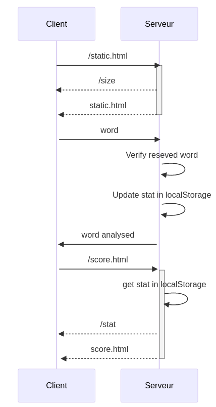
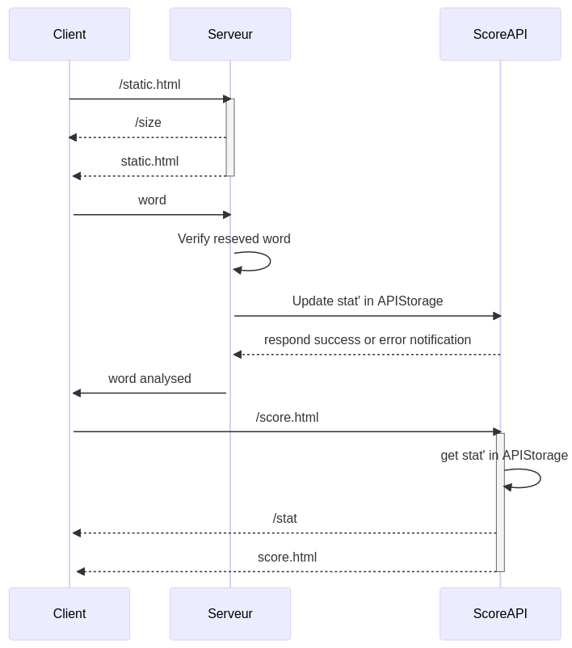

# SUTOM
Microservices Project
The main rule is to find the word with the least try. 

# The SUTOM architecture.

Sequence diagram of the project before the login and microservice implementation.

Sequence diagram of the project after the microservice implementation.

## About the Score Microservice
Server: localhost
Port used: 5000
API used: ScoreAPI ? with 3 parameters: the number of word fund, the number of try and the user id.
Thanks to this API we can handle several user. The API will store the statistics of each user. E.g, we store the number of word fund, the number of try, the average of try and all datas about the user like id, username/pseudo or password. 

## About the Architecture

Architecture of our application. 

# How RUN the Project ?
