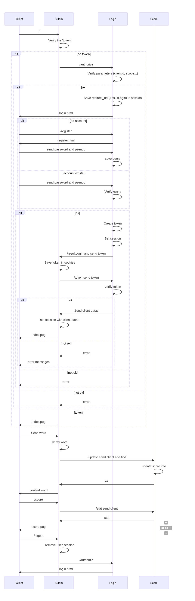

# SUTOM
Microservices Project by CHEVRIER CHhléo and MAURICE Ambre.

SUTOM is a study sproject. It's a reproduction of the game MOTUS. The main rule of the game is to find the word with the least try. 
The player has, also, the possibility to sign in, and see it's score.

# The SUTOM architecture.


Sequence diagram of the project.

The project is construct with 3 microservices:
- the Sutom microservice, is used to play the game.  
- the Score microservice, is used to compute and share the score to the sutom microservice
- the Login microservice, is used to login/register the user and share its information to sutom microservice

## About the Sutom microservice
- Server: localhost

- Port used: 3000

- API used: Sutom

Its main used is to implement the game sutom. It computes the word of the days. When, the player send its proposition word the microservice will verify the word. 

It is also used to communicate with other microservice. The microservice will verify if the user is connected. If not it will redirect the user to the login page. To do this operation the server need to communicate with the microservice login. After some verification the login microservice will send all user's informations, included token, id, name/pseudo, to the sutom microservice. The sutom microservices will save these information to the session. It can also communicate with the score microservice. for example when the user ask for it's score the serveur will send a request to the score microservice. The score microservice will send the user's stat.  

## About the Score microservice
- Server: localhost

- Port used: 5000

- API used: Score with 1 parameters: the user id.

The API will store the statistics of each user. E.g, we store the number of word fund, the number of try, the average of try and the user id. This microservice will also update these informations when the user send it's word to the sutom microservice. the sutom microservice will after send some information to the score microservice and it will update the score. More over, it can also share the statistics of a players to the sutom microservice.  
 
## About the Login Microservice
- Server: localhost

- Port used: 8000

- API used: Login

This API is used to autentificate the user. The server store the id, password (hash) of each user and the connection token (which is expired in 15min). When the user try to play but is not connected it's automatically redirect to this API. The user can choose to login or register. When the user enter its pseudo and password the serveur will verify its informations and/or it will save its datas. The user's information is store in the session. Moreover, the Login microservices generate the token used to know if the user is connected. The token is expired in 15min. The API will also share the user's information like its id, pseudo and token.        

# How RUN the Project ?

In the root folder you can find the start.sh document. To run the entire project you can just used the following command.  
```
./start.sh
```
After you can connect to http://localhost:3000/ in a navigator to see the web site. 
